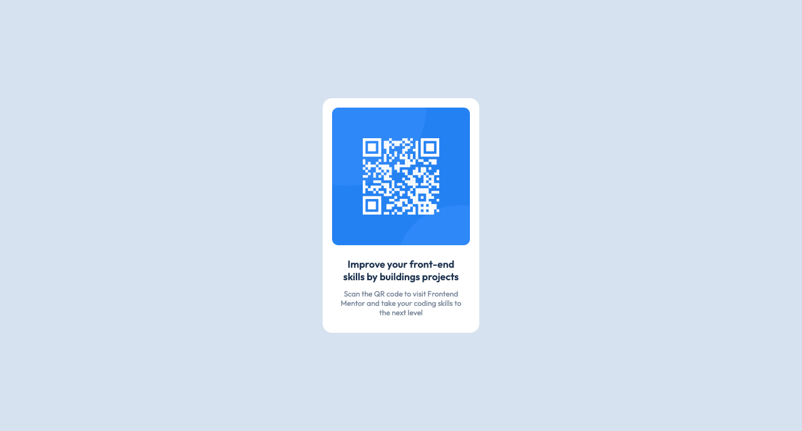

# Qr-Component
This is a Qr component developed with HTML5 and CSS3, builded with the directions provided by Frontmentor.io

## Overview

This is a solution for Qr componente for Frontmentor.io; two technologies were used: HTML and CSS. For the responsive design it was used flexbox and media queries

## Screenshots

## Solution's Links

- Solution URL: [Click Here](https://github.com/yomidev/Qr-Component)
- Live Site URL: [Click Here](https://yomidev.github.io/Qr-Component/)

## Built with

- HTML5
- CSS3
- Flexbox
  
## What I learned

IIn this project, practice more flexbox and use all flexbox properties.

## Author

Yomira Martínez